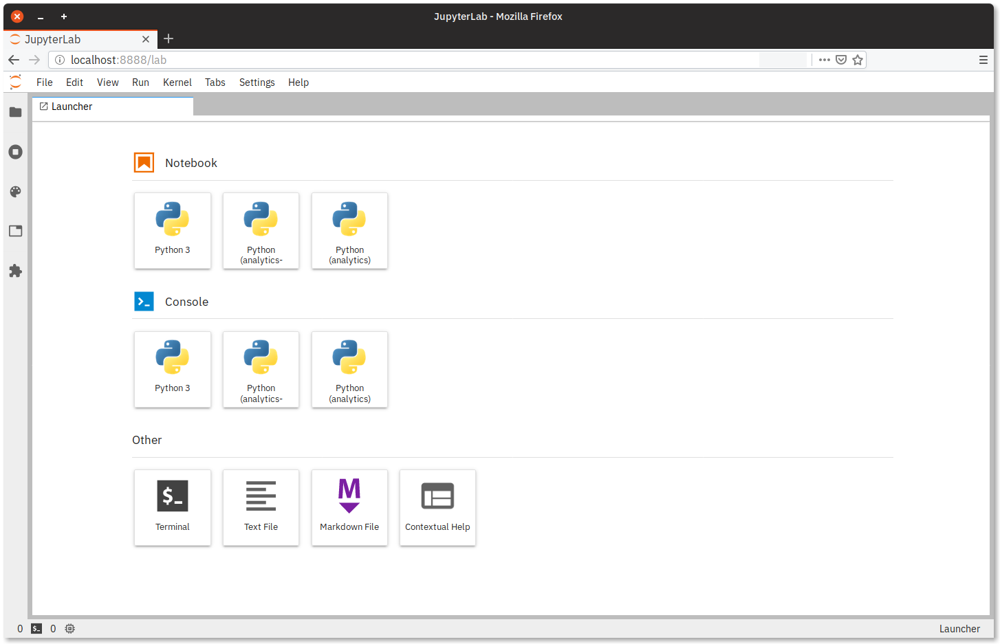

The following allows to set up a `conda` environment with Jupyter Lab, including extensions, and add independent Python kernels. Thanks to this setup, one can separate the IDE (Jupyter Lab) from the environment packages (like pandas, plotly, and so on). It also makes possible to test different environments, therefore different versions of the same packages.

## Install the Jupyter Lab environment

The `conda` environment specification is stored in `jupyter-lab.yml`.

## Install the extensions

The executable `extensions.sh` (in coordination with `jupyter-lab.yml`) installs some extensions into Jupyter Lab: [git support](https://github.com/jupyterlab/jupyterlab-git), [table of contents](https://github.com/jupyterlab/jupyterlab-toc), [code formatter](https://github.com/ryantam626/jupyterlab_code_formatter), [go to definition](https://github.com/krassowski/jupyterlab-go-to-definition), [spell checker](https://github.com/ijmbarr/jupyterlab_spellchecker) and [plot.ly for charts rendering](https://plot.ly/python/getting-started/). This can obviously be extended.

If you want to use the `Black` formatter with a keyboard shortcut, as well as the Quick Open extension, you can add to the Jupyter Lab Settings — Settings → Advanced Settings Editor → Keyboard Shortcuts —, the [formatter](https://github.com/ryantam626/jupyterlab_code_formatter) and [quick open](https://github.com/parente/jupyterlab-quickopen) shortcuts.
```
"shortcuts": [
    {
        "command": "jupyterlab_code_formatter:black",
        "keys": [
            "Ctrl K",
            "Ctrl L"
        ],
        "selector": ".jp-Notebook.jp-mod-editMode"
    },
    {
        "command": "quickopen:activate",
        # Accel is Ctrl on Linux
        "keys": [
            "Accel P"
        ],
        "selector": "body",
        "title": "Activate Quick Open",
        "category": "Main Area"
    }
]
```

## Add the Python kernels

Once the IDE environment is set up, you can add all the Python kernels to be available in the IDE. If `my_environment` is the name of the `conda` environment, activate `my_environment` and run the command
```
python -m ipykernel install --user --name my_environment --display-name "Python (my_environment)"
```
Both the `name` and `display-name` can be customized.

In the image below, the above procedure has been applied to two different environments, `analytics` and `analytics-updated`. The genuine `Python 3` corresponds to the native kernel from Jupyter Lab.

